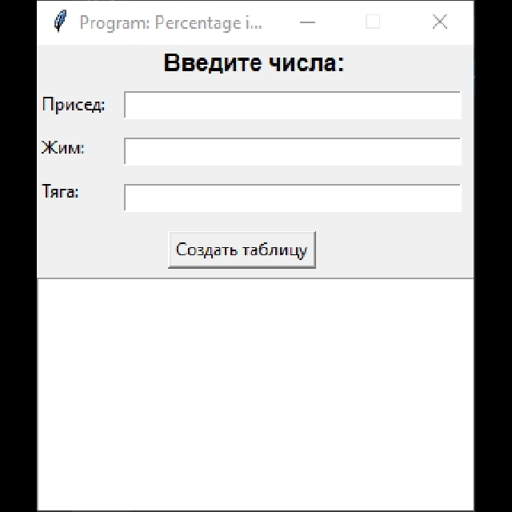

# Program: Percentage in Powerlifting (PiP) ver 0.3

  

## Описание

По нажатию на кнопку программа берет введённое число и создает таблицу тренировочного процесса на 10 недель.

Программа расчитывает шаг в процентах от первой недели в 50% до 10-той недели!

> Больше подробностей в [ТЗ-1](Assets/Program_Percentage_in_Powerlifting_PiP_ver_0_1.pdf), [ТЗ-2](Assets/Program_Percentage_in_Powerlifting_PiP_ver_0_2.pdf)

---

## Использование

- **VSCode** - запустить `main.py`
- **Windows** - запустить `start.cmd`
  - Ввести цифру
  - Нажать `Создать таблицу`
  - Получить результат
- **exe**
  - Запустить ?

---

# Ссылки
| Описание | Ссылка |
| ------ | ------ |
Репо: | [github.com/gitalexhubuser/TrainingPlanApp](https://github.com/gitalexhubuser/TrainingPlanApp)
