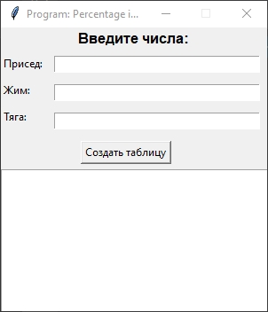

# Program: Percentage in Powerlifting (PiP) ver 0.2

<!--  -->
<!--  -->

## Описание

По нажатию на кнопку программа берет введенное число и создает таблицу тренировочного процесса на 10 недель.

Мы берём 200 за 100%, первая неделя присед всегда 50% от наших 100%.

В данном случае от числа 200 (у нас это 100 кг).

На 10-тую неделю вес должен быть *200 кг*.
> *190 кг* если шаг 10%

Программа расчитывает шаг в процентах от первой недели в 50% до 10-той недели!

> Больше подробностей в [ТЗ](Program_Percentage_in_Powerlifting_PiP_ver_0_1.pdf)

---

## Использование
- **VSCode** - запустить `main.py`
- **Windows** - запустить `start.cmd`
    - Ввести цифру
    - Нажать `Создать таблицу`
    - Получить результат

---

# Ссылки
| Описание | Ссылка |
| ------ | ------ |
Репо: | [github.com/gitalexhubuser/TrainingPlanApp](https://github.com/gitalexhubuser/TrainingPlanApp)
