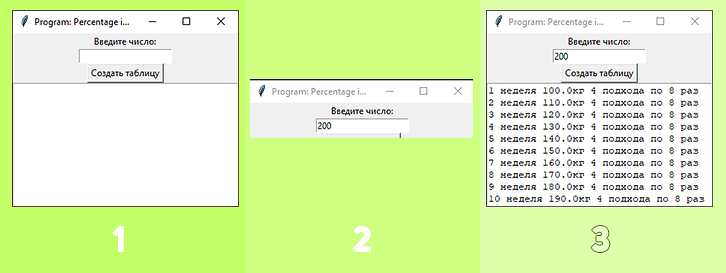

# Program: Percentage in Powerlifting (PiP) ver 0.1

## Описание

---

## Использование
- VSCode - запустить main.py 
- Windows - запустить start.cmd
    - Ввести цифру
    - Нажать "Создать таблицу"
    - Получить результат

---

# Ссылки
| Описание | Ссылка |
| ------ | ------ |
Репо: | [github.com/gitalexhubuser/TrainingPlanApp](https://github.com/gitalexhubuser/TrainingPlanApp)
